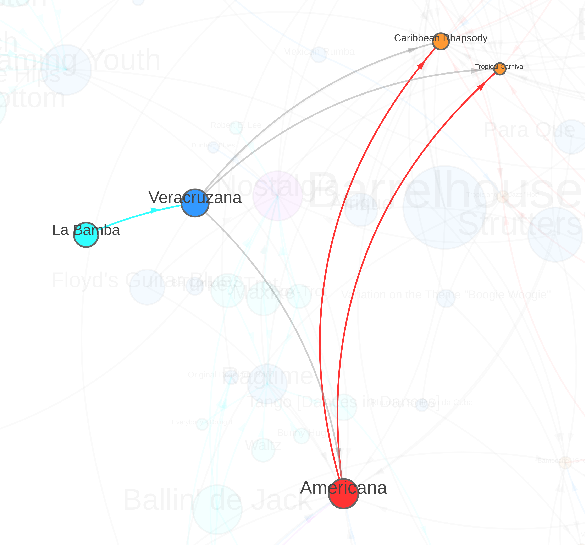

# Introduction
The [“Interactive Network of Dunham Company Repertory: Shows, Containers, Pieces, and Dances-in-Dances”](https://visualizations.dunhamsdata.org/repertory) is a web-based solution to visualize the Repertory Dataset (available from [NADAC](https://doi.org/10.3886/ICPSR38545)). Over her career, Katherine Dunham actively repurposed and recombined elements of her choreography, and our team needed a way to show their relationships. Organized into a nested hierarchy of shows, containers, pieces, and dances-in-dances, this visualization makes it possible to interactively examine the many interconnections among Dunham’s repertory, troubling the choreographic ‘work’ as a static category. Although repertory from 1937-1962 is represented, the data is most complete for the 1947-60 time period.

This interactive tool is mainly composed of two types of elements: nodes and edges. A key initial decision was to choose how these components would render the repertory data. In network analysis, nodes represent the objects of interest, and therefore, they constitute the entities of the company’s repertory in this case study. Edges, however, symbolize connections between nodes, and we use them to represent relationships of belonging within the nested hierarchy of Dunham’s choreography.[^choreography] Regarding interaction, the user can drag nodes, click on them for alternate names, and hover over them to highlight the entities directly connected or all the entities within the nested hierarchy, among others. The interactive repertory network offers a tool to untangle the interconnected set of elements that compose the company's body of knowledge and helps to understand what constitutes a work in Dunham's repertory.

[^choreography]: This [blog post](https://dunhamsdata.org/blog/ach2021) by Kate Elswit and Harmony Bench expands on this repertory organization and illustrates it with examples.

The process of creating the interactive repertory network has two key steps: data wrangling and web-based visualization. First, the information is extracted from the Repertory Dataset and then turned into a network structure. Second, a web application is built to visualize the network. The data required for every type of element is:[^element]
- For nodes: title, alternative titles, size (proportional to the number of events documented), and color (according to the category in the hierarchy—aqua for dances, blue for pieces, purple for mixed works, red for containers, and orange for shows).
- For links: source node, target node, and color (taken from the source node or gray for pieces that are sometimes part of other containers, but may also be a standalone work).

[^element]: This information is not provided separately, but altogether in the same network file.

# Preparing the data
All the references to the Repertory Data used from now on refer to the slim version of the original dataset, and the procedures described in this document are based on it. The slim Repertory Data is released on its corresponding [GitHub repository](https://github.com/DunhamsData/RepertoryNetwork) along with the source code of the project.

The source Repertory Dataset contains all the necessary information for nodes and links.[^links] It is stored on Google Sheets, however, a local copy is downloaded for its analysis. I chose Python and, more specifically, Pandas for my data processing because it makes managing tabular data very simple, and NetworkX for effortlessly building graphs. I wrote my scripts in Jupyter Notebooks for its ease of creating and sharing my codes and results. The notebooks with the source code and the data can be found on [GitHub](https://github.com/DunhamsData/RepertoryNetwork).

[^links]: For detailed information on this dataset, refer to the [“Dunham's Data Repertory Dataset User Guide”](https://www.dunhamsdata.org/sites/default/files/2023-04/38545-0001-DunhamsDataRepertoryUserGuide.pdf).

I started the data preparation by turning its tabular format into a graph. This transformation is possible thanks to the dataset organization into a nested hierarchy that contains the necessary information to be understood as a network. In particular, the repertory dataset is stored on a spreadsheet that is composed of three worksheets or tabs: Main Repertory, Dances in Dances, and Shows. Every row in the main repertory tab represents a choreographic work, and this tab in turn has two key columns, “Pieces” (column E) and “Larger Works” (column F), from where we can build belonging relationships between the repertory works. The column E contains a list of constituting elements, while the column F contains a list of entities this work is absorbed into (sometimes, works stand alone). In other words, elements in column E are part of this work and this work is part of the elements listed in column F.

The tabs Dances in Dances and Shows have similar columns that indicate belongingness with respect to the entities in the Main Repertory. Dances in Dances’ column B (“Appears In”) typically has one piece name (although more than one is possible too), signifying the piece(s) this dance is part of. Shows’ column C (“Pieces”), likewise, lists the pieces that are part of this show. This data model, against what the cell grid may suggest, is totally graphy and decoupled from the idea of tables. The following algorithm outlines the steps for this data transformation (see notebook [02](https://github.com/DunhamsData/RepertoryNetwork/blob/master/02-repertory_network.ipynb), cell [14]):

```
Input: Repertory Dataset
Output: Directed Graph
1   g ← empty directed Graph
2   for each row in Main Repertory tab, do
3       w ← row[‘Work’]
4       add node w to g
5       for each work in row[‘Pieces’], do
6           add node work to g if it is not in g yet
7           add relationship < w→work > to g
8       end
9       for each work in row[‘Larger Works’], do
10          add node work to g if it is not in g yet
11          add relationship < work→w > to g
12      end
13  end
14  for each row in Dances in Dances tab, do
15      d ← row[‘Dance’]
16      add node d to g
17      for each work in row[‘Appears In’], do
18          add relationship < d→work > to g
19      end
20  end
21  for each row in Shows tab, do
22      s ← row[‘Show’]
23      add node s to g
24      for each work in row[‘Pieces’], do
25          add relationship < work→s > to g
26      end
27  end
```

<div align="center"><i>Algorithm 1. Algorithm to create Repertory Graph</i></div>
<br>

The next step is to classify the repertory to make the nested hierarchy come up ([02](https://github.com/DunhamsData/RepertoryNetwork/blob/master/02-repertory_network.ipynb) [15]). I assigned a category to every piece based on the following set of rules:

```
Input: Repertory Dataset
Input: Directed Graph
Output: Directed Graph
1   for each node in g, do
2       if node is in Dances in Dances tab, do
3           category ← ‘Dance’
4       if node is in Shows tab, do
5           category ← ‘Show’
6       if node is in Main Repertory tab, do
7           if node is isolated:
8               category ← ‘Piece’
9           if node only has incoming relationships, do
10              if all neighbors are Dances, do
11                  category ← ‘Piece’
12              otherwise, do
13                  category ← ‘Container’
14              end
15          if node only has outgoing relationships, do
16              category ← ‘Piece’
17          if node has both incoming and outgoing relationships, do
18              if all incoming neighbors are Dances, do
19                  category ← ‘Piece’
20              if all outgoing neighbors are Shows, do
21                  category ← ‘Container’
22              otherwise, do
23                  category ← ‘Mixed Work’
24              end
25          end
26      end
27      node.Category ← category
28  end
```

<div align="center"><i>Algorithm 2. Algorithm to classify the Repertory Graph</i></div>
<br>

The three worksheets included in the Repertory Dataset are now consolidated in one single structure, a graph, that stores the piece categories and the belonging relationships existing among them. Finally, I saved the graph to a GEXF file for further processing on the web side.[^side]

[^side]: I left out of this document all the issues related to node size.

Let's summarize these ideas using Dunham’s Veracruzana as an example. Veracruzana has a row in the Main Repertory tab. It does not contain any name under its column “Pieces” (E3), therefore, it is not a Container nor a Mixed work, but a Piece. Veracruzana has Americana listed under column “Larger Works” (F3)[^F3], meaning that Veracruzana is part of Americana, which is in turn classified as a Container by the algorithm.[^algorithm] When processing the Dances in Dances tab, we see that La Bamba “Appears in” Veracruzana (B2). Regarding the Shows tab, the shows Caribbean Rhapsody and Tropical Carnival list Veracruzana, as well as Americana, under their column “Pieces” (C2 and C3, respectively). Figure 1 illustrates the result of this process.

[^F3]: “n/a” indicates that Veracruzana not always is part of a larger work, but can also stand alone.
[^algorithm]: The data is consistent, that is, Americana has in turn Veracruzana listed under its column “Pieces”, among others (E2).

<div align="center">



<div><i>Figure 1. Veracruzana</i></div>
</div>
<br>

# Designing the web interface
In this process of web design, I used [dash-network](https://github.com/plotly/dash-network), a Python library that combines [D3.js](https://d3js.org/) with [React.js](https://reactjs.org/) to create interactive networks. It is, in turn, built on [Dash](https://dash.plotly.com/), a Python framework for creating interactive web applications that is written on top of [Flask](https://flask.palletsprojects.com/), [Plotly.js](https://plotly.com/javascript/) and [React.js](https://reactjs.org/). I also needed JavaScript, CSS, and the library jQuery for additional user interaction. Another dependency is [Tooltipster](https://calebjacob.github.io/tooltipster/), a jQuery plugin for tooltips that I use here for showing node information.

The first step is to clone the dash-network project from GitHub. In the command line:

```
$ git clone git@github.com:plotly/dash-network.git
```

This will create a folder named “dash-network”. This is your root folder—rename it as you like. The second step is to install all the required libraries contained in the file “requirements.txt”. In the command line:

```
$ pip install -r requirements.txt
```

The third step is to create a file with extension .py, for example, app.py, in the previous folder and write your code. I started by initializing the dash app with my required external JavaScript libraries and style sheets:

```py
app = dash.Dash(
    __name__,
    external_scripts=[
        'https://code.jquery.com/jquery-3.4.1.min.js',
        'https://code.jquery.com/ui/1.12.1/jquery-ui.js',
        'https://d3js.org/d3.v4.min.js',
    ],
    external_stylesheets=[
        'https://codepen.io/chriddyp/pen/bWLwgP.css',
    ]
)
```

<div align="center"><i>Code 1. Dash app initialization</i></div>
<br>

Then I set the web layout, that is, the look and feel of the app. I defined a function that takes no arguments and returns a list of nested HTML components. Then the result is assigned to the property “layout” of the above-created variable “app”:

```py
def create_layout():
    return html.Div([
        ...,
        html.Div(
            Network(
                id='network',
                data=net_data(),
                width=DIV_WIDTH,
                height=DIV_HEIGHT,
            ),
            id='net-div',
            className='net-class',
        ),
        ...,
    ], id='layout')

app.layout = create_layout()
```

<div align="center"><i>Code 2. Layout creation (part 1)</i></div>
<br>

The code above creates a key div that contains a network type of component, which is instantiated by means of the function “net_data”. A simplified version of this function is below:

```py
def net_data():
    g = nx.read_gexf('repertory.gexf')
    nodes = [{
            'id': n,
            'radius': data['size'],
            'color': node_colors_dct[data['type']],
            'aka': data['aka'] if 'aka' in data else '',
        }
        for n, data in g.nodes(data=True)
    ]
    links = [{
            'source': a,
            'target': b,
            'color': edge_colors_dct[data['style']],
            'weight': data['weight'],
        }
        for a, b, data in g.edges(data=True)
    ]
    return {
        'nodes': nodes,
        'links': links
    }
```

<div align="center"><i>Code 3. Data instantiation</i></div>
<br>

The function “net_data” parses the GEXF created in the previous section and returns a graph formatted as two lists of nodes and links, respectively. The variables “node_colors_dct” and “link_colors_dct” are two dictionaries that map the type of node and link to a color.

Finally, to view the web application, we need to run our local web server like in Flask. Add the following code:

```py
if __name__ == '__main__':
    app.run_server(debug=True, port=8051)
```

<div align="center"><i>Code 4. Running the web server</i></div>
<br>

And run the python script. For example,

```
$ python app.py
```

Next, open your browser and go to http://127.0.0.1:8051 to see your network. On page load, D3's force layout animation starts until it stabilizes. Then, you can drag and drop nodes and the full network will recalculate its new layout. To reload the network, I added a button and an associated callback to the app’s layout.

```py
def create_layout():
    return html.Div([
        ...,
        html.Div([
            html.A('', id='reload')
        ]),
        ...,
    ], id='layout')
```

<div align="center"><i>Code 5. Layout creation (part 2)</i></div>
<br>

```py
@app.callback(
    Output('layout', 'children'),
    Input('reload', 'n_clicks'),
)
def update_data(n_clicks):
    return create_layout()
```

<div align="center"><i>Code 6. Callback function</i></div>
<br>

The property “n_clicks” is available in every Dash HTML component and it gets incremented each time the component has been clicked on. This property is listened to and when its value changes, it will automatically trigger the callback. In the code above, whenever the button “reload” is clicked on, the function “update_data” will be called and a new layout will replace the old one.

```py
def create_layout():
    return html.Div([
        ...,
        html.Div([
            html.A('', id='reload', className='control-elem'),
            html.A('', id='play', className='control-elem'),
            html.A('', id='pause', className='control-elem'),
        ]),
        ...,
    ], id='layout')
```

<div align="center"><i>Code 7. Layout creation (part 3)</i></div>
<br>

The reload component, which is actually an “a” tag, is not alone—it comes along with two other “a” components, play and pause, that altogether control the network animation (see Code 7). These components have background images that create the illusion of being clickable icons. Besides, they are enabled and disabled when appropriate. This kind of custom look and interaction is achieved with JavasScript and CSS. External resources can be “imported” when initializing the Dash app (see Code 1), however, to add JavaScript and CSS files locally, it is necessary to create a folder named “assets” in the root folder and include the local files in it.

```
- app.py
- assets/
    |-- script.js
    |-- style.css
```

<div align="center"><i>Diagram 1. Textual representation of the app root’s partial content</i></div>
<br>

# Deployment
There are different alternatives to share this application. I am describing below the deployment on Heroku and Python Anywhere. These platforms allow us to focus on application development rather than configuring web servers, installing Linux packages, setting up load balancers, and everything else that goes along with infrastructure management on a traditional server.

## Deployment on Heroku

[Heroku](https://www.heroku.com/) is still the most popular option. It is no longer free but it is relatively simple for deploying and managing public Flask applications. You first need a Heroku account and [git](https://git-scm.com/) installed on your computer.[^computer] You also need to install [gunicorn](https://gunicorn.org/).[^gunicorn] In the command line:

[^computer]: This guide assumes you already meet the prerequisites.
[^gunicorn]: Gunicorn, aka "Green Unicorn", is a Python Web Server Gateway Interface HTTP server for UNIX.

```
$ pip install gunicorn
```

The next step is to add this line in your app.py after initializing the Dash app:

```py
app = dash.Dash(...)
server = app.server
```

<div align="center"><i>Code 8. Initializing the “server” variable</i></div>
<br>

Create a Procfile[^procfile] with the following content:

[^procfile]: Procfile is a file that specifies the commands that are executed by a Heroku app on startup.

```
web: gunicorn app:server
```

The line above means that the web server and the app server are communicating via gunicorn. Note that “app” is the name of your Python file (app.py) and “server” is the variable created in Code 8.

Generate a requests.txt file with your Python dependencies the following way. In the command line:

```
$ pip freeze > requirements.txt
```

Finally, initialize Heroku, add files to git, and deploy. In the command line:

```
$ heroku create my-dash-app-name
$ git add . # add all files to git
$ git commit -m 'Initial commit
$ git push heroku master # deploy code to heroku
$ heroku ps:scale web=1  # run the app with 1 heroku "dyno"
```

For code updates:

```
$ git status # view the changes
$ git add .  # add all the changes to git
$ git commit -m 'Description of changes'
$ git push heroku master # deploy new code to heroku
```

## Deployment on Python Anywhere
[Python Anywhere](https://www.pythonanywhere.com/) is free and pre-configured for Flask. You first need to create a Python Anywhere account (for example, your username is paw), but before starting, make sure you follow these preliminary steps on your code:

1. Comment the following lines on your app.py file:

```py
# if __name__ == '__main__':
# 	app.run_server(debug=True, port=8051)
```

<div align="center"><i>Code 9. Disabling development server</i></div>
<br>

2. Use absolute paths. For example:

```py
import os
absolute_path = os.path.dirname(os.path.abspath(__file__))
data_filename = '...'
data_path = os.path.join(absolute_path, data_filename)
```

<div align="center"><i>Code 10. Using absolute paths</i></div>
<br>

The remaining instructions are based on [this tutorial](https://www.youtube.com/watch?v=5jbdkOlf4cY). Log in on Python Anywhere, and once on your dashboard, go to Consoles, create a new Bash console, and clone the application code from your repository:

```
$ git clone URL_to_your_repository
```

This will create a folder (named for example my-dash-app-name) that will contain the code. Now create a virtual environment:

```
$ mkvirtualenv myvenv --python='/usr/bin/python3.8' (or your Python version)
```

Install the requirements:

```
$ pip install -r requirements.txt
```

Exit the console and go back to your dashboard. Then go to Web, click on Add a new web app, click on Manual configuration (instead of on Flask), select your Python version (Python 3.8 in this example), and click next. Your web app has been now created but it still needs some setups: under Virtualenv, type the name of you virtual environment (myvenv in this example) and accept; under Code section, type the name folder that contains the code (rep_net_app in the example) and accept; finally, still under the Code section, click on the link to the WSGI configuration file and follow the next steps:

1. Comment or delete the sample code.
2. Scroll down to the Flask section and uncomment everything with one hash (#) and replace where appropriate. These are five lines in total:

```py
import sys
path = '/home/paw/my-dash-app-name'
if path not in sys.path:
	sys.path.append(path)
from app import server as application
```

<div align="center"><i>Code 11. Configuring the WSGI file</i></div>
<br>

In the last line, note again that “app” is the name of your Python file (app.py) and “server” is the variable created in Code 8.

And this is it. Go back to Web, click on Reload paw.pythonanywhere.com, and finally go to https://paw.pythonanywhere.com (enable Force HTTPS first on the same Web section) to see your app running.

Altogether, your python app code should look like the sketch on the next page. These are the basics for creating an interactive network from repertory data. Read [dash-network](https://github.com/plotly/dash-network) and [Dash](https://dash.plotly.com/) documentations for more examples and detailed information.

# APPENDICES

## APPENDIX A. Simplified app code

```
import dash
import dash_core_components as dcc
import dash_html_components as html
from dash.dependencies import Input, Output
from dash_network import Network
import networkx as nx

def net_data():
    g = nx.read_gexf('repertory.gexf')
    nodes = [{
            'id': n,
            'radius': data['size'],
            'color': node_colors_dct[data['type']],
            'aka': data['aka'] if 'aka' in data else '',
        }
        for n, data in g.nodes(data=True)
    ]
    links = [{
            'source': a,
            'target': b,
            'color': edge_colors_dct[data['style']],
            'weight': data['weight'],
        }
        for a, b, data in g.edges(data=True)
    ]
    return {
        'nodes': nodes,
        'links': links
    }

def create_layout():
    return html.Div([
        ...,
        html.Div(
            Network(
                id='network',
                data=net_data(),
                width=DIV_WIDTH,
                height=DIV_HEIGHT,
            ),
            id='net-div',
            className='net-class',
        ),
        html.Div([
            html.A('', id='reload', className='control-elem'),
            html.A('', id='play', className='control-elem'),
            html.A('', id='pause', className='control-elem'),
        ]),
        ...,
    ], id='layout')


app = dash.Dash(
    __name__,
    external_scripts=[
        'https://code.jquery.com/jquery-3.4.1.min.js',
        'https://code.jquery.com/ui/1.12.1/jquery-ui.js',
        'https://d3js.org/d3.v4.min.js',
    ],
    external_stylesheets=[
        'https://codepen.io/chriddyp/pen/bWLwgP.css',
    ]
)
app.layout = create_layout()
server = app.server

@app.callback(
    Output('layout', 'children'),
    Input('reload', 'n_clicks'),
)
def update_data(n_clicks):
    return create_layout()

if __name__ == '__main__':
    app.run_server(debug=True, port=8051)
```

## APPENDIX B. Source code and data
**Data preparation**:

Input data:
- data/src/repertory/Repertory Reconciled (Full).xlsx

Notebooks and execution order:
1. 01-repertory_data.ipynb
1. 02-repertory_network.ipynb

**Web interface**:

Source code: https://github.com/DunhamsData/RepertoryNetwork/tree/master/web

## APPENDIX C. Dependencies
- [Python](https://www.python.org/) (required Python >=3.9)
- [dash_network](https://github.com/plotly/dash-network)
- [Dash](https://dash.plotly.com/)
- [jQuery](https://jquery.com/)
- [Tooltipster](https://calebjacob.github.io/tooltipster/)
- [Python Anywhere](https://www.pythonanywhere.com/) (server)
